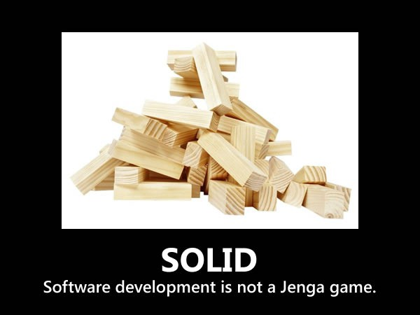

## Solid dưới dạng meme :v
Phát triển phầm mềm không nên là 1 trò chơi xếp gỗ, có 1 lỗi nhỏ là phá hủy toàn bộ phần mềm của bạn

## Single Responsibility Principle
Mỗi lớp chỉ có một trách nhiệm duy nhất, và rằng trách nhiệm đó nên được đóng gói hoàn toàn bởi lớp đó. Nó chỉ có 1 lý do duy nhất để thay đổi class

## Open/Close Principle
Class nên đóng để sửa đổi và mở để mở rộng hiểu là nó chạy ngon rồi thì k động vào nó nữa, tạo ra 1 em khác kế thừa nó là mở rộng em khác. thì những cái chạy ở code cũ sẽ không bị ảnh hưởng nữa
lưu ý : trong trường hợp đang phát triển thì thay đổi vi phạm OCP được còn trong trường hợp thành production rồi thì sửa là vi phạm, hoặc ít nhất chỉ sửa khi có bug thôi

## Liskkov Substitution Principle
Nếu s là 1 loại phụ của t thì đối tượng ở dạng t có thể được đặt ở dạng s mà không làm hỏng chương trình ví dụ ở chương trình này employee thay bằng manager hay CEO ở chỗ new object()

## Interface Segregation Principle
1 khách hàng(class) không nên buộc phải phụ thuộc vào các giao diện (Interface) mà họ không sử dụng

## Dependency Inversion Principle
Module cấp cao không nên phụ thuộc vào module cấp thấp cả 2 nên phụ thuộc vào phần trừu tượng (abstraction) và những phần trừ tượng đó không nên phụ thuộc vào chi tiết (tức là ta tìm cách đảo ngược để module cấp thấp phụ thuộc vào module cấp cao

